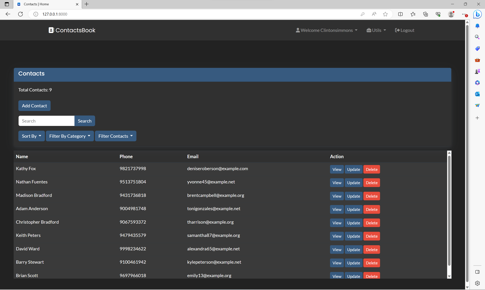
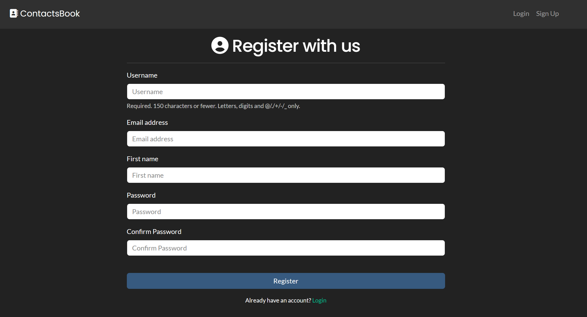

# Contacts App - Django Contact Management

The Contacts App is a feature-rich web application built using Django, designed to streamline contact management efficiently. With an intuitive user interface and advanced features, this app allows users to organize, categorize, and maintain their contacts seamlessly.

## Screenshots
**Home Page**

**SignUp Page**


## Getting Started

To set up and run the Contacts App on your local machine, follow the steps below:

### Prerequisites

- Python 3.x

### Installation

1. Clone the repository to your local machine (if you haven't already):

```
git clone https://github.com/VaishnavSherla/Contacts-App.git
```

2. Change into the project directory:

```
cd Contacts-App
```

3. Create Virtual Env and Install Requirements:

```
python -m venv env
env\Scripts\activate  # On Windows
source env/bin/activate  # On macOS/Linux
pip install -r requirements.txt
```

### Database Setup

1. Create and apply database migrations:

```
python manage.py makemigrations
python manage.py makemigrations ContactsApp
python manage.py migrate
```

2. Create a superuser to access the admin interface:

```
python manage.py createsuperuser
```

### Generate Sample Data (Optional)
This command will generate sample data which create user accounts with username and password that are the same. 

This means that the generated username will also be used as the password for each corresponding user account.

If you want to populate the database with sample data for testing, use the following command:

```
python manage.py generatedata
```

## Features

- **User-friendly Interface:** The Contacts App uses Bootstrap and offers a simple and intuitive user interface, making it easy for users to navigate and manage contacts efficiently.

- **Contact Details:** Add comprehensive details for each contact, such as first and last names, phone numbers, email addresses, addresses, company names, birthdays, and more.

- **Categorization:** Categorize contacts based on their roles and relationships, allowing quick access and efficient organization.

- **Favorites:** Mark essential contacts as favorites for instant access from the favorites list.

- **Profile Pictures:** Personalize the contact list by uploading profile pictures for each contact.

- **Validation:** Robust validation mechanisms ensure data integrity, prompting users for correct input of phone numbers, email addresses, and birthdays.

- **Change Password:** Users can update their account passwords securely.

- **Filter by Birthday:** View contacts based on their upcoming birthdays.

## Feedback

We appreciate user feedback to improve the Contacts App further. Feel free to open issues, suggest improvements, or share your thoughts with us.

Enjoy using the Contacts App for efficient contact management!